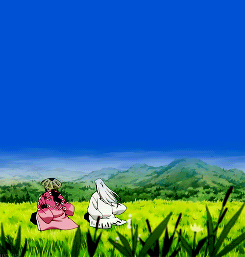

<h1 align="left"> Hey 👋, I'm Hanna </h1>

  

> [!IMPORTANT]
> - 🌱 Currently learning **how to learn**  
>   🐣 ➡️ 🐒 ➡️ 🦧 ➡️ 🧎‍➡️ ➡️ 🚶‍➡️ ➡️ 🏃‍➡️ ➡️ 🧑‍💻 ➡️ 🧠 ⚡  
>
> - 👇 You can check out some of my **work below**  
>   🔍 🛠️ 💡 📂 ✨ 🚀

### 🚀 About Me

   
  <i>I am nothing</i>🧘

